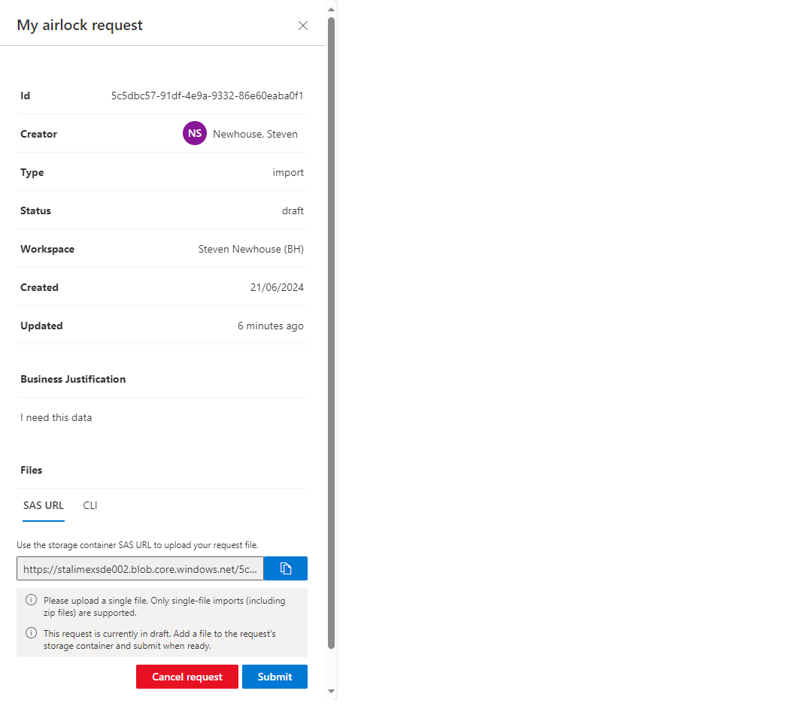

# Working with data

For details about software and applications available on the VMs, [see the FAQ](FAQ.md).

There are two ways to get data into your workspace, and one way to get data out. Data can be provisioned as part of the workspace configuration, following approval by the DAC, or it can be imported/exported via the **Airlock** mechanism.

## Data provisioning via the DAC

Data requested in the DAR will be prepared for you and pushed into the workspace, onto the shared storage disk.

## The Airlock mechanism

The Airlock metaphor captures the way users can import their own data into their workspace, or export it from it. There is no direct access to allow data to be moved into/out of the workspace storage, instead, someone must review the data in each case, and approve or deny the request.

### Importing data
For importing, the workflow looks like this:
* A researcher creates a request to import data,
* Then they upload their data to secure storage, as part of the request process,
* Then they submit the request.
* An **Airlock Manager**, who is appointed per project, will review the request, and approve or deny it.
* If approved, the researcher will then receive an email with a secure URL to allow them to retrieve data from the workspace, using a VM within the workspace.

The **create-upload-submit** approach seems a bit odd at first, but the logic is sound. Once you **submit**, you can no longer **upload** to the same request, which means the data you've uploaded is immutable. That means we can be sure that the data we review is the data you will get.

Exporting data works exactly the same way, just with the flow reversed, starting from an upload in the VM, instead of outside.

Note that you can only import or export a **single file** at a time. If you want to transfer multiple files, you can always zip them together, that's fine.

#### Creating an airlock request
As a pre-requisite, you need either to have the [Azure CLI](https://learn.microsoft.com/en-us/cli/azure/install-azure-cli) installed on your laptop, or to have the [Azure Storage Explorer](https://azure.microsoft.com/en-us/products/storage/storage-explorer) installed. This example shows the workflow using the Storage Explorer, using the CLI is more self-explanatory, assuming you're familiar with it.

In your workspace, in the sidebar on the left, there's an **Airlock** button. Click that, and you'll see the Airlock landing page. In this example, there are no requests yet. Click the **New request** button to create one.

Choose between an import request and an export request.

Give a name and a justification, then click **Create**, then confirm that you want to create the request.

Once your request is created, you need to upload the data before you **submit** the request.

A request can only contain a single file, so if you have multiple files, create a tar or zip of them, and upload that. There are two ways to upload your single file, either using a **SAS URL**, or using the **Azure CLI**. At this point, the submission form will have refreshed and at the end of the form there are two tabs (SAS URL and CLI) that provide information needed for the next stage.

NB: If you click away from the form, it will disappear. In that case, refresh the Airlock landing page, and you'll see your request there, in **draft** form. Double-click on it, and the form will open again.

This example uses the SAS URL. The default tab provides the information needed for the Azure Storage Explorer tool. The CLI tab provides a command line example you will need to complete if uploading from the command line using the Azure CLI.

Now open the Azure Storage Explorer. If this is your first time using it, click the **Sign in with Azure** tile, and follow the instructions. Then come back and click **Attach to a resource**,

and then **Blob container or directory**.

Select **Shared access signature URL (SAS)**, paste in the URL from your request, click **Next**, then **Connect**.

Use the **Upload** button and select your data file for upload. Leave the parameters at their defaults, and complete the upload. The Storage Explorer should then look like this, showing that your file ("pi.txt", in this example) has been successfully uploaded. You can also drag-and-drop into the Storage Explorer to upload your file that way.

Go back to the airlock form, or re-open it by double-clicking on your request in the airlock landing page, and click **Submit**.

An email will be sent to the airlock reviewer, who will then review your data to check it's safe for upload. They will approve or deny your request, and you will be notified by email of the result.

#### Retrieving the data in a workspace VM

If your request has been approved, you can double-click on the request and see the new SAS URL that you can use for downloading the data into your VM. The Azure Storage Explorer is already installed in the workspace VM images (`storage-explorer` on the Linux command line, or currently only the Data Science VMs for Windows), so you can launch it, and use the same method as above for downloading the file. The first time you run storage-explorer you will may to run:
`sudo snap connect storage-explorer:password-manager-service :password-manager-service`

### Exporting data
The export process is entirely analogous, simply starting from the workspace VM with the upload of a (possibly tarred or zipped) file.

## Shared Storage
There's also the possibility of using **shared storage** to share files between multiple VMs. E.g., if you have a Windows VM and a Linux VM so that you can use OS-specific tools, you may want to share your data between those machines.

We configure workspaces with 500 GB of shared storage by default, and can increase that at any time if you need more. Shared storage is valuable because it will outlive the individual VMs, if you create a file on shared storage on a VM, delete the VM, then create a new VM, it will find the file still there.

On Windows VMs, the shared storage is be mounted on the `Z:` drive. On Linux VMs, the shared storage is mounted under the `/shared-storage` folder.

The files in this folder are always owned by the currently logged-in user, whichever OS you're using, even if you're using multiple machines, so there's no concept (yet) of a proper multi-user filesystem.
